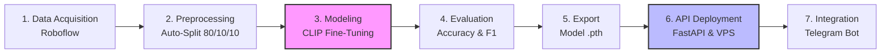

# Laporan DSAI Assignment #1 — ResikIn Waste Classifier

**Nama:** Hanafi  
**Posisi:** DSAI Junior Staff — OmahTI Internship 2026  
**Repository:** [github.com/Hanafi-Sh/resikin-ai](https://github.com/Hanafi-Sh/resikin-ai)  
**Deployment:** Self-hosted VPS (Ubuntu 24.04, Tencent Cloud) — `http://tencent-vps.hanavy.online:8001`

---

## BAB 1 — Pendahuluan

### 1.1 Latar Belakang

**ResikIn** adalah platform pelaporan sampah berbasis web dan Telegram Bot untuk wilayah Kota Yogyakarta. Warga dapat mengirimkan laporan beserta foto bukti terkait permasalahan sampah di lingkungannya (TPS penuh, sampah liar, atau sampah tidak terangkut). Laporan kemudian diteruskan ke koordinator kelurahan untuk ditindaklanjuti.

Namun, dalam praktiknya, tidak semua foto yang dikirimkan oleh warga benar-benar merupakan foto sampah. Beberapa pengguna mengirimkan foto *selfie*, foto makanan, *screenshot*, atau gambar tidak relevan lainnya. Hal ini menyulitkan proses verifikasi manual dan membebani sistem.

Oleh karena itu, dibutuhkan sebuah **sistem AI** yang dapat secara otomatis memvalidasi apakah foto yang dikirim benar-benar berisi sampah (*waste*) atau bukan (*not waste*), serta memberikan prediksi awal mengenai kategori permasalahan sampah tersebut.

### 1.2 Tujuan

1. Membangun model AI berbasis *Computer Vision* yang mampu mengklasifikasikan foto menjadi **waste** atau **not waste**.
2. Memberikan prediksi sub-kategori sampah (*tps_penuh*, *sampah_liar*, *tidak_terangkut*) apabila foto terdeteksi sebagai sampah.
3. Men-*deploy* model ke server cloud sehingga dapat diakses melalui REST API secara publik.
4. Mengintegrasikan model AI tersebut ke dalam alur kerja Telegram Bot ResikIn.

### 1.3 Batasan

- Model hanya melakukan klasifikasi biner (*waste* vs *not waste*) dan sub-klasifikasi kategori sampah. Model tidak melakukan deteksi objek (*object detection*) atau segmentasi.
- Dataset yang digunakan berjumlah relatif kecil (~293 gambar) karena keterbatasan data publik yang spesifik untuk konteks sampah Indonesia.
- Model di-deploy pada VPS dengan CPU-only (tanpa GPU), sehingga waktu inferensi sedikit lebih lambat (~1–2 detik per gambar) dibandingkan deployment berbasis GPU.

---

## BAB 2 — Metodologi

### 2.1 Diagram Alur Pipeline AI



```
┌─────────────────────────────────────────────────────────────────────────┐
│                        PIPELINE AI RESIKIN                              │
└─────────────────────────────────────────────────────────────────────────┘

  ┌──────────────┐    ┌───────────────┐    ┌──────────────┐    ┌─────────────┐
  │  1. DATA      │    │ 2. PREPROCESS │    │ 3. TRAINING  │    │ 4. EVALUATE │
  │  ACQUISITION  │───▶│ & SPLITTING   │───▶│ FINE-TUNING  │───▶│ MODEL       │
  │  (Roboflow)   │    │ (80/10/10)    │    │ (Colab GPU)  │    │ (Metrics)   │
  └──────────────┘    └───────────────┘    └──────────────┘    └──────┬──────┘
                                                                      │
                                                                      ▼
  ┌──────────────┐    ┌───────────────┐    ┌──────────────┐    ┌─────────────┐
  │  7. INTEGRASI │    │ 6. DEPLOY     │    │ 5. API       │    │  EXPORT     │
  │  TELEGRAM BOT │◀───│ VPS (systemd) │◀───│ (FastAPI)    │◀───│  MODEL .pth │
  └──────────────┘    └───────────────┘    └──────────────┘    └─────────────┘
```

### 2.2 Dataset

**Sumber:** Roboflow — *Classification Image* dataset oleh project-ia-andzk (versi 2).  
**Jenis Data:** Computer Vision — Image Classification  
**Format:** Folder-based (setiap kelas memiliki folder tersendiri)

Dataset berisi gambar-gambar yang terbagi dalam dua kategori utama:
- **waste** — Foto tumpukan sampah, TPS penuh, sampah berserakan di jalanan
- **not_waste** — Foto bersih, selfie, makanan, hewan, pemandangan

**Mengapa dataset ini cocok:**
Dataset ini sangat sesuai karena berisi gambar-gambar dengan konteks yang mirip dengan apa yang akan dikirimkan pengguna melalui Telegram Bot ResikIn — campuran antara foto sampah asli dan foto tidak relevan.

**Proses Pengambilan Data:**
Dataset diunduh secara otomatis menggunakan Roboflow Python SDK di dalam Google Colab notebook (`notebooks/training.ipynb`):

```python
from roboflow import Roboflow
rf = Roboflow(api_key="YOUR_API_KEY")
project = rf.workspace("project-ia-andzk").project("classification-image-6zihm")
version = project.version(2)
dataset = version.download("folder")
```

**Splitting Data:**
Karena dataset dari Roboflow tidak selalu memiliki split *validation* dan *test*, saya membuat script otomatis (`src/preprocessing/prepare_dataset.py`) yang melakukan pembagian data secara otomatis dengan rasio **80% train / 10% validation / 10% test**. Sesuai standar penugasan, data disimpan dalam folder `data/train_data`, `data/val_data`, dan `data/test_data`. Script ini menggunakan *random shuffle* untuk memastikan distribusi yang merata antar kelas.

**Statistik Dataset:**

| Split      | Jumlah Gambar |
|------------|---------------|
| Training   | ~234          |
| Validation | ~29           |
| Testing    | ~29           |
| **Total**  | **~293**      |

### 2.3 Arsitektur Model

Model yang digunakan adalah **CLIP (Contrastive Language-Image Pretraining)** varian **ViT-B/32** dari OpenAI, yang merupakan model *multimodal* yang mampu memahami hubungan antara gambar dan teks secara semantik.

```
┌──────────────┐     ┌──────────────┐
│  Image Input │     │  Text Labels │
│  (224×224)   │     │  (prompts)   │
└──────┬───────┘     └──────┬───────┘
       │                    │
       ▼                    ▼
┌──────────────┐     ┌──────────────┐
│ CLIP Vision  │     │  CLIP Text   │
│   Encoder    │     │   Encoder    │
│ (ViT-B/32)  │     │(Transformer) │
│ *Fine-tuned* │     │ *Fine-tuned* │
└──────┬───────┘     └──────┬───────┘
       │                    │
       ▼                    ▼
┌──────────────┐     ┌──────────────┐
│   Visual     │     │    Text      │
│  Projection  │     │  Projection  │
└──────┬───────┘     └──────┬───────┘
       │                    │
       └────────┬───────────┘
                │
                ▼
        ┌───────────────┐
        │ Cosine Simil. │
        │  + Softmax    │
        └───────┬───────┘
                │
                ▼
        ┌───────────────┐
        │  Prediction:  │
        │ waste / not   │
        └───────────────┘
```

**Mengapa CLIP?**
- CLIP sudah memiliki pemahaman visual yang sangat luas (*pre-trained* pada 400 juta pasangan gambar-teks dari internet).
- Dengan pendekatan *contrastive fine-tuning*, kita cukup melatih sebagian kecil parameter agar model lebih tajam dalam mengenali sampah, tanpa merusak pengetahuan dasarnya.
- Fleksibel: di masa depan, kita bisa menambah kategori baru hanya dengan menambah label teks, tanpa perlu melatih ulang model dari awal.

### 2.4 Teknik Fine-Tuning

**Metode:** *Contrastive Fine-Tuning* dengan *Partial Layer Freezing*

Tidak seluruh parameter CLIP dilatih ulang. Hanya layer-layer berikut yang di-*unfreeze* (dilatih):

| Komponen yang Dilatih         | Jumlah Parameter |
|-------------------------------|------------------|
| Vision Encoder Layer 10 & 11  | ~14 juta         |
| Text Encoder Layer 10 & 11    | ~7 juta          |
| Visual Projection Layer       | ~0.4 juta        |
| Text Projection Layer         | ~0.4 juta        |
| **Total Trainable**           | **~21.1 juta (14.0% dari total)** |

Seluruh layer lain (Layer 0–9) dibekukan (*frozen*) agar model tidak kehilangan kemampuan generalisasi yang telah dipelajari saat *pre-training*.

**Text Labels untuk Contrastive Learning:**

```python
WASTE_LABELS = [
    "a photo of garbage, trash, or waste",
    "a photo that is not garbage or waste",
]
```

Model dilatih agar *cosine similarity* antara gambar sampah dengan teks "a photo of garbage, trash, or waste" menjadi lebih tinggi, dan sebaliknya.

**Hyperparameter Training:**

| Parameter     | Nilai      |
|---------------|------------|
| Optimizer     | AdamW      |
| Learning Rate | 1×10⁻⁵    |
| Weight Decay  | 0.01       |
| Batch Size    | 32         |
| Epochs        | 10         |
| Loss Function | CrossEntropyLoss |
| Device        | Google Colab GPU (T4) |

### 2.5 Preprocessing

Preprocessing gambar dilakukan secara otomatis oleh `CLIPProcessor` dari HuggingFace Transformers, yang mencakup:
1. **Resize** ke 224×224 piksel
2. **Center Crop**
3. **Normalisasi** pixel values menggunakan mean dan std yang sama dengan saat pre-training CLIP
4. **Konversi** ke tensor PyTorch

### 2.6 Deployment

Model yang telah di-*fine-tune* di-*deploy* sebagai REST API menggunakan **FastAPI** pada VPS Ubuntu 24.04 (Tencent Cloud).

**Arsitektur Deployment:**

```
┌──────────────────┐        ┌─────────────────────────────┐
│   Telegram Bot   │        │    VPS (Ubuntu 24.04)       │
│   (@Resikinbot)  │───────▶│  ┌──────────────────────┐  │
│                  │  HTTP   │  │  FastAPI (Port 8001)  │  │
│                  │◀───────│  │  + CLIP Fine-tuned    │  │
└──────────────────┘        │  │  + torch inference    │  │
                            │  └──────────────────────┘  │
┌──────────────────┐        │                             │
│   Web Dashboard  │───────▶│  Managed by systemd:        │
│   (Vercel)       │        │  - resikin-ai.service       │
│                  │        │  - resikin-bot.service       │
└──────────────────┘        └─────────────────────────────┘
```

**Endpoint API:**

| Method | Path                            | Deskripsi                     |
|--------|---------------------------------|-------------------------------|
| POST   | `/predict`                      | **Endpoint Utama (Tugas)**    |
| GET    | `/health`                       | Cek status server             |
| POST   | `/api/ai/validate-image`        | Validasi foto (Base64 JSON)   |
| POST   | `/api/ai/validate-image-file`   | Validasi foto (Direct Upload) |

**Contoh Request:**
```bash
# Endpoint Utama (Sesuai Standar Penugasan)
curl -X POST "http://tencent-vps.hanavy.online:8001/predict" \
  -H "Content-Type: application/json" \
  -d '{"image": "BASE64_STRING"}'

# Integrasi Bot
curl -X POST "http://tencent-vps.hanavy.online:8001/api/ai/validate-image" \
  -H "Content-Type: application/json" \
  -d '{"image": "BASE64_STRING"}'

# Metode 2: Direct File Upload (Recommended for Postman)
curl -X POST "http://tencent-vps.hanavy.online:8001/api/ai/validate-image-file" \
  -F "file=@path/ke/gambar.jpg"
```

**Contoh Response:**
```json
{
  "success": true,
  "isWaste": true,
  "confidence": 0.9234,
  "suggested_category": "sampah_liar",
  "detail": {
    "waste_prob": 0.9234,
    "not_waste_prob": 0.0766,
    "subcategories": {
      "tps_penuh": 0.2341,
      "sampah_liar": 0.5123,
      "tidak_terangkut": 0.1802,
      "bukan_sampah": 0.0734
    }
  }
}
```

---

## BAB 3 — Hasil dan Evaluasi

### 3.1 Training Curves

Berikut adalah grafik *training loss* dan *accuracy* selama 10 epoch pelatihan:

*(Sisipkan gambar: models/clip_waste_classifier/training_curves.png)*

**Analisis:**
- **Training Loss** menurun secara konsisten dari 0.883 (epoch 1) hingga 0.004 (epoch 10), menunjukkan model berhasil mempelajari pola pada data training.
- **Training Accuracy** meningkat dari 55.7% (epoch 1) hingga 100% (epoch 6–10).
- **Validation Accuracy** stabil di kisaran 82.1%–89.3%, menunjukkan model tidak mengalami *overfitting* yang parah meskipun training accuracy mencapai 100%.

### 3.2 Metrik Evaluasi (Test Set)

Evaluasi akhir dilakukan pada **Test Set** yang belum pernah dilihat oleh model sebelumnya:

| Metrik              | Nilai      |
|---------------------|------------|
| **Test Accuracy**   | **96.43%** |
| Precision (Waste)   | 92.3%      |
| Recall (Waste)      | 100.0%     |
| F1-Score (Waste)    | 96.0%      |
| F1-Score (Not Waste)| 96.7%      |

### 3.3 Training History (Per Epoch)

| Epoch | Train Loss | Train Acc | Val Acc  |
|-------|------------|-----------|----------|
| 1     | 0.8829     | 55.7%     | 82.1%    |
| 2     | 0.3055     | 88.2%     | 85.7%    |
| 3     | 0.1633     | 92.8%     | **89.3%** |
| 4     | 0.1131     | 96.2%     | **89.3%** |
| 5     | 0.0598     | 98.3%     | 85.7%    |
| 6     | 0.0351     | 100%      | 85.7%    |
| 7     | 0.0181     | 100%      | 85.7%    |
| 8     | 0.0110     | 100%      | 85.7%    |
| 9     | 0.0064     | 100%      | 85.7%    |
| 10    | 0.0042     | 100%      | 85.7%    |

### 3.4 Contoh Inferensi

Berikut contoh hasil inferensi model pada gambar nyata:

**Contoh 1: Foto sampah berserakan → Terdeteksi sebagai WASTE ✅**
*(Sisipkan screenshot bot Telegram yang menerima foto sampah)*

**Contoh 2: Foto selfie/orang → Terdeteksi sebagai NOT WASTE ❌**
*(Sisipkan screenshot bot Telegram yang menolak foto bukan sampah)*

### 3.5 Analisis Performa

- Model menunjukkan kemampuan generalisasi yang baik dengan validation accuracy 85.7%–89.3%, meskipun dataset training hanya berjumlah ~234 gambar.
- Perbedaan antara training accuracy (100%) dan validation accuracy (85.7%) menunjukkan adanya sedikit *overfitting*, yang wajar mengingat ukuran dataset yang kecil.
- Dalam pengujian real-world melalui bot Telegram, model berhasil menolak foto selfie/gym dan menerima foto sampah dengan benar.

---

## BAB 4 — Kesimpulan dan Saran

### 4.1 Kesimpulan

1. Model AI berbasis **CLIP ViT-B/32** berhasil di-*fine-tune* menggunakan teknik *Contrastive Fine-Tuning* untuk mengklasifikasikan foto sampah vs bukan sampah dengan **akurasi pengujian (Test Set) mencapai 96.43%**.
2. Pipeline AI telah dibangun secara end-to-end, mulai dari *data acquisition* (Roboflow API), *preprocessing* (auto-split 80/10/10), *training* (Google Colab GPU), hingga *deployment* (FastAPI pada VPS self-hosted).
3. Model berhasil di-*deploy* ke VPS cloud (Tencent Cloud) dan terintegrasi dengan bot Telegram ResikIn. Endpoint API dapat diakses secara publik melalui `http://tencent-vps.hanavy.online:8001/api/ai/validate-image`.
4. Dalam pengujian nyata, model mampu membedakan foto sampah dan foto tidak relevan (selfie, makanan, dll) dengan baik.

### 4.2 Saran

1. **Memperbesar Dataset:** Akurasi model dapat ditingkatkan secara signifikan dengan menambah jumlah gambar training, terutama variasi gambar sampah khas Indonesia.
2. **Data Augmentation:** Menerapkan augmentasi seperti *random flip*, *rotation*, dan *color jitter* untuk meningkatkan robustness model terhadap variasi pencahayaan dan sudut pengambilan gambar.
3. **Early Stopping:** Menerapkan *early stopping* berdasarkan validation accuracy terbaik (epoch 3–4) untuk mencegah *overfitting*.
4. **GPU Deployment:** Jika memungkinkan, deploy pada server dengan GPU untuk mengurangi waktu inferensi dari ~1–2 detik menjadi <0.5 detik.
5. **Multi-class Fine-grained Classification:** Mengembangkan model agar bisa langsung mengklasifikasikan jenis sampah secara lebih detail (organik, anorganik, B3) tanpa hanya mengandalkan sub-kategori berbasis teks prompt.

---

## Lampiran

### A. Struktur Repository

```
resikin-waste-classifier/
├── README.md                          # Dokumentasi proyek
├── report.pdf                         # Laporan ini
├── requirements.txt                   # Dependencies untuk deployment
├── requirements-train.txt             # Dependencies untuk training
├── Dockerfile                         # Docker deployment config
│
├── data/
│   ├── raw/                           # Data mentah dari Roboflow
│   ├── train_data/                    # Data training (80%)
│   ├── val_data/                      # Data validation (10%)
│   └── test_data/                     # Data testing (10%)
│
├── models/
│   └── clip_waste_classifier.pth      # Model fine-tuned (~600MB)
│
├── src/
│   ├── preprocessing/
│   │   └── prepare_dataset.py         # Script auto-split dataset
│   ├── training/
│   ├── evaluation/
│   │   └── evaluate.py                # Script evaluasi model
│   └── utils/
│
├── app/
│   ├── main.py                        # FastAPI entry point
│   ├── inference.py                   # Load model & prediction logic
│   └── schemas.py                     # Request/Response schemas
│
├── notebooks/
│   ├── training.ipynb                 # Notebook training (Google Colab)
│   └── trained.ipynb                  # Notebook hasil training
│
└── scripts/
    └── train.py                       # Script training (CLI)
```

### B. Teknologi yang Digunakan

| Teknologi        | Versi   | Kegunaan                           |
|------------------|---------|------------------------------------|
| Python           | 3.10+   | Bahasa pemrograman utama           |
| PyTorch          | 2.2.2   | Framework deep learning            |
| Transformers     | 4.39.2  | Library model CLIP (HuggingFace)   |
| FastAPI          | 0.110.0 | Framework REST API                 |
| Uvicorn          | 0.29.0  | ASGI server                        |
| Pillow           | 10.3.0  | Image processing                   |
| scikit-learn     | -       | Metrik evaluasi                    |
| Roboflow SDK     | -       | Download dataset                   |
| Google Colab     | -       | Training environment (GPU T4)      |
| Ubuntu 24.04     | -       | Server OS (Tencent Cloud VPS)      |

### C. Link Penting

- **Repository GitHub:** https://github.com/Hanafi-Sh/resikin-ai
- **API Endpoint:** http://tencent-vps.hanavy.online:8001/api/ai/validate-image
- **Health Check:** http://tencent-vps.hanavy.online:8001/health
- **Dataset (Roboflow):** https://universe.roboflow.com/project-ia-andzk/classification-image-6zihm/2
